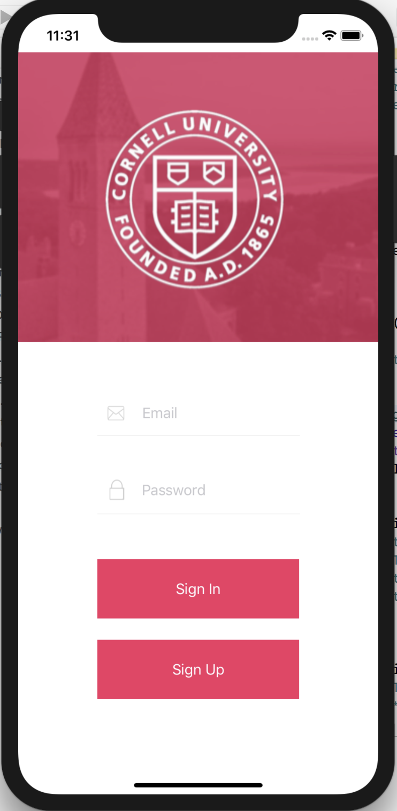
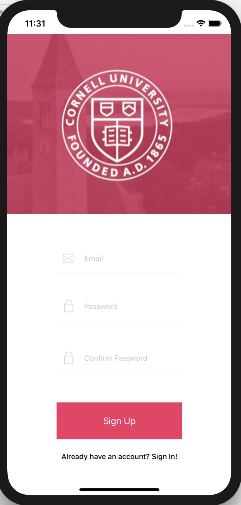
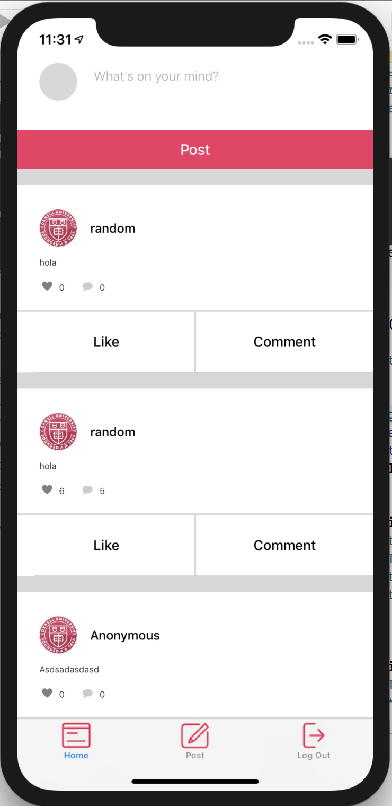
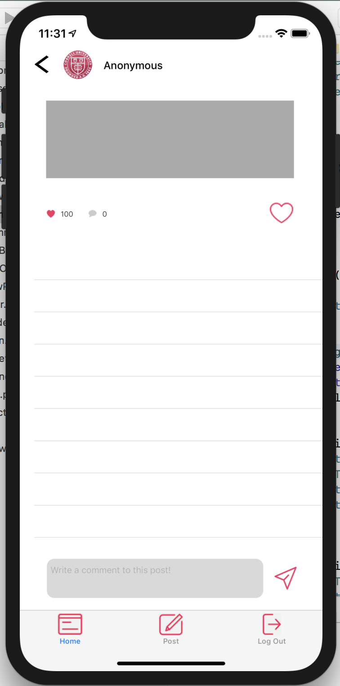
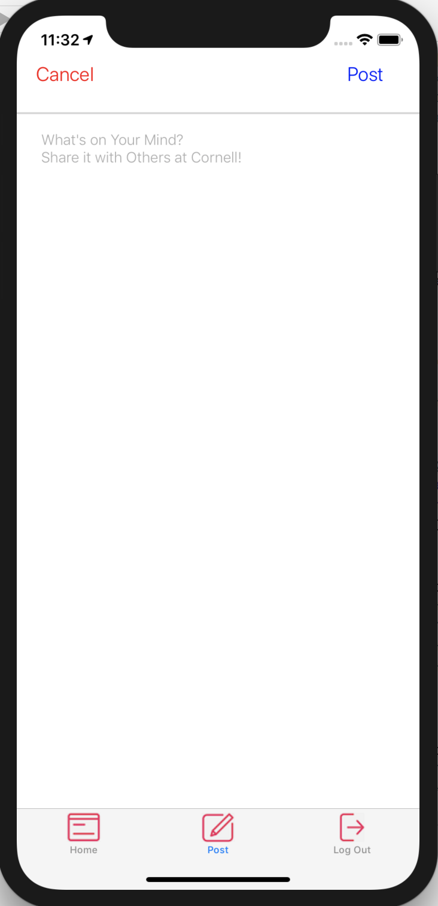

# Confessions

## App Tagline: 
Cornell’s anonymous confessions sharing app.

## Links: 
https://github.com/lucyxubroad/confessions-ios-backend

## Initial App Design:

## Screenshots of App: 

## Purpose: 
Our app is a social media app with the purpose of allowing the users to anonymously post the feelings and thoughts. The first view when the app is opened is the sign in/sign up screen. We require each user to sign in/sign up so that we can keep track of the different users. After you sign in, you will be shown the main feed where you can make your own post (you can also make a new post on the post tab) and see other posts that were made surrounding your location. You can like a post or comment on the post. If you press the comment button, you will be taken to a different view where you can see all the comments previously made and comment yourself. On the tab bar, the post tab gives you another way to make a post. You will also find the sign out tab where you can sign out of the tab.

## Project Requirements: 
### iOS: 
We used AutoLayout using SnapKit to create the bounds for each of our views. We used UITableView to create a table of posts in the main feed and a table of comments once a post is opened. We used a UITabBarController to navigate between the main feed, the new post view, and the sign in/sign up view and it is our root view after the initial sign in/sign up view is dismissed. We used the API Alamofire to get data from our server. We used the API CoreLocation to get the location of the user so that we can link each post to a location and sort the posts on the feed based on the user's current location.
### Backend:
Since Confessions is a twist on traditional social media applications, backend support for the app had to include a database to store posts, comments, and users. A lot of the backend was borrowed from P5, which had routes for posting posts, posting comments, liking posts, and getting posts and comments.

However, we made modifications to support some of the nuances of Confessions, which includes anonymous users, showing only posts made in area vicinity, and deletion of posts after 24 hours of posting. We modified the backend by adding longitude and latitude fields to the posts and adding a route that retrieves only posts made within a 5000 meter radius of the user's location. We added timestamps to each post so that after 24 hours, they will no longer be displayed in the app. We also added user authentication that assigns anonymous usernames to each user to protect their privacy.
# Notes:
Since we initially designed the app, we decided not to use Google Sign In. We changed the design a little including the sign in and sign up views as well as adding a new view for writing a post. 

Due to time constraints, we were unable to make a lot of our app work the way we had hoped. We had planned for the log in and sign up to work but we were unable to make that functional. We also had trouble making the table view of the comments show up when a post was clicked on. We were also unable to update the number of likes and post that onto the server. One small bug we have is when logout is clicked, the tab bar still shows and you can go back and view the feed again. We were unable to fix this bug.
